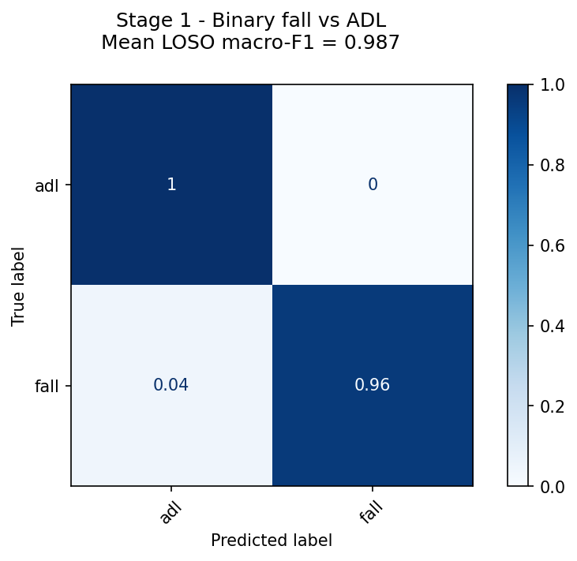
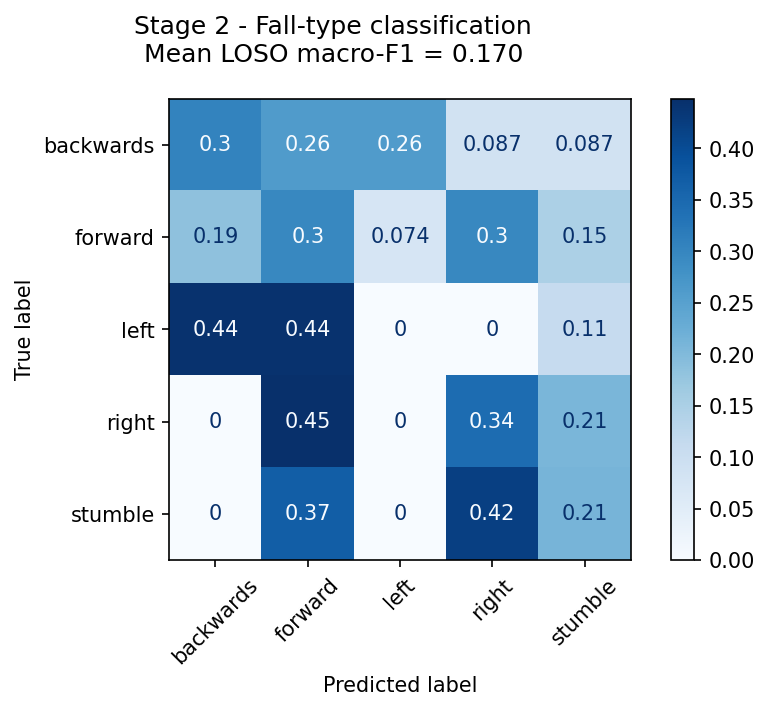

# Smartphone-Based Fall Detection Using IMU Sensor Data

## 1. Introduction

Falls are a major safety risk in many areas, especially in elderly care, workplace safety, and situations where people work alone or in physically demanding environments. A delayed response after a fall can lead to serious health consequences, particularly if the affected person is unable to call for help.

The goal of this project is to develop a smartphone-based fall detection prototype using inertial measurement unit (IMU) sensor data. Modern smartphones contain sensors such as accelerometers and gyroscopes, which can record body movement and impact patterns during daily activities and falls. By analysing these signals, the system should be able to distinguish between normal activities of daily living and fall events.

For data collection, the project uses the Sensor Logger app to record smartphone IMU data. The planned fall classes are forward falls, backward falls, sideways falls, and trip-stumble events. In addition, normal activities such as walking, sitting, stair movement, and jumping are recorded as non-fall examples.

The technical goal is to build a machine learning pipeline that processes Sensor Logger ZIP files, extracts relevant features from the sensor signals, and predicts whether a fall occurred. If a fall is detected, the system should also estimate the fall type and the impact intensity. The prototype will be demonstrated through a Streamlit web application that allows users to upload a Sensor Logger ZIP file and view the prediction results in an understandable way.

From a business and application perspective, the project is relevant for workplace safety, health monitoring, and assisted living scenarios. For an industrial audience such as Schaeffler, smartphone-based fall detection can be understood as a lightweight and low-cost example of sensor-based safety analytics. The project also demonstrates how machine learning can be applied to real-world time-series data collected with commonly available devices.

## 2. Related Work

Fall detection using smartphones and wearable sensors has been widely researched. Most systems use inertial measurement unit (IMU) data, especially accelerometer and gyroscope signals, to distinguish between falls and normal activities of daily living. Smartphones are especially useful for this task because they already include the required motion sensors and do not require additional hardware.

Casilari et al. (2015) provide a broad overview of Android-based fall detection systems. Their work shows that smartphone sensors can be used for fall detection, but also highlights important challenges such as sensor placement, device differences, and realistic evaluation conditions. These challenges are relevant for this project because the collected data may come from different smartphones and placements.

Public fall datasets provide useful guidance for the design of this project. The SisFall dataset by Sucerquia et al. (2017) contains multiple fall types and activities of daily living and includes a structured data collection protocol with safety considerations. The MobiFall dataset by Vavoulas et al. (2014) is particularly relevant because it focuses on fall detection and classification using a smartphone. Its fall categories, such as forward, backward, and sideways falls, are similar to the fall taxonomy used in this project.

Machine learning approaches are commonly used for sensor-based fall detection. Zurbuchen et al. (2021) show that classical machine learning models such as Random Forest and Gradient Boosting can achieve strong results on wearable sensor data. For this project, these methods are more realistic than complex deep learning models because the dataset is collected by a small student team and is therefore limited in size.

Feature extraction is an important part of fall detection. Typical features include statistical measures such as mean, standard deviation, minimum, maximum, signal magnitude, acceleration peaks, and jerk. The tsfresh library described by Christ et al. (2018) is useful for extracting a large number of time-series features and can support a classical machine learning pipeline.

Based on the reviewed literature, this project follows a practical approach: smartphone IMU data is collected with the Sensor Logger app, preprocessed in Python, transformed into features, and then used for fall detection and fall-type classification. The results are presented in a Streamlit web application that allows users to upload Sensor Logger ZIP files and view the prediction output.

### References

Casilari, E., Luque, R., & Morón, M. J. (2015). Analysis of Android Device-Based Solutions for Fall Detection. Sensors, 15(8), 17827–17894. https://doi.org/10.3390/s150817827

Sucerquia, A., López, J. D., & Vargas-Bonilla, J. F. (2017). SisFall: A Fall and Movement Dataset. Sensors, 17(1), 198. https://doi.org/10.3390/s17010198

Vavoulas, G., Pediaditis, M., Chatzaki, C., Spanakis, E. G., & Tsiknakis, M. (2014). The MobiFall Dataset: Fall Detection and Classification with a Smartphone. International Journal of Monitoring and Surveillance Technologies Research, 2(1), 44–56. https://doi.org/10.4018/ijmstr.2014010103

Zurbuchen, N., Wilde, A., & Bruegger, P. (2021). A Machine Learning Multi-Class Approach for Fall Detection Systems Based on Wearable Sensors with a Study on Sampling Rates Selection. Sensors, 21(3), 938. https://doi.org/10.3390/s21030938

Christ, M., Braun, N., Neuffer, J., & Kempa-Liehr, A. W. (2018). Time Series Feature Extraction on Basis of Scalable Hypothesis Tests. Neurocomputing, 307, 72–77. https://doi.org/10.1016/j.neucom.2018.03.067

# 3. Methodology

## 3.1 General Methodology

The development of the fall-detection system follows the CRISP-DM process model adapted to the constraints of a student project with self-collected data. Business and data understanding are reflected in §1 (Introduction) and §3.2 (Data Understanding and Preparation), where the application context, the fall taxonomy, and the data collection protocol are documented. The modelling and evaluation steps are described in §3.3.

The technical approach prioritises interpretability and reproducibility over peak accuracy. We use a classical machine learning pipeline with hand-crafted features and a Random Forest classifier rather than deep learning, because the limited size of our self-collected dataset (435 recordings, three subjects) does not support reliable training of high-capacity models, and because a feature-based approach allows us to inspect feature importances and link them back to physical properties of the signal.

Three design decisions characterise our methodology. First, we use a two-stage classifier architecture (binary fall-vs-ADL followed by fall-type classification), so that the operationally important binary decision is not contaminated by the harder direction-classification subproblem. Second, we use Leave-One-Subject-Out cross-validation throughout, which directly measures the model's ability to generalise to new individuals rather than to new windows from familiar individuals. Third, we use peak-aligned windowing for fall recordings and sliding windowing for activities of daily living, which ensures that the positive samples in the Stage 1 training set actually contain a fall event rather than the surrounding stillness.

The complete data path from a Sensor Logger ZIP file to a prediction is implemented as a sequence of pure Python modules under `src/` (`parsing.py`, `preprocessing.py`, `features.py`, `train.py`, `inference.py`). The pipeline is reproducible end-to-end: regenerating all derived data and retrained models from the raw recordings requires only `python -m src.build_dataset` followed by `python -m src.train`. The trained models are loaded by the Streamlit application through a single `predict(folder_path)` function exposed by `src/inference.py`.

# 3.2 Data Understanding and Preparation

## Data collection setup

The dataset for this project was collected entirely by the three team members (Felix, Leopold, Lea) using personal iPhones running the Sensor Logger app by Kelvin Choi. All three devices recorded with the "Standardise Units & Frames" setting in its default OFF state. This is acceptable for our use case because all subjects used iPhones, which use a consistent axis convention; the setting would have been required if the dataset had mixed iOS and Android devices. Each phone recorded at a target sampling rate of 100 Hz. Three motion sensors were enabled per recording: the calibrated accelerometer, the gyroscope, and gravity. Each recording was exported as a Zipped CSV containing one CSV file per sensor plus a `Metadata.csv` describing the device and sampling configuration.

Every recording was named according to a fixed schema `{subject}_{placement}_{class}_{trial}_{date}`, for example `felix_pocket_stumble_03_20260523`. This schema is the single source of truth for labels in the pipeline: it is parsed in `src/preprocessing.py` to extract the subject, placement, fall class, trial number, and date for each recording, which eliminates the need for a separate metadata table.

## Classes recorded

The dataset distinguishes twelve classes, grouped into five fall classes and seven activities of daily living (ADL):

- Fall classes: `backwards`, `forward`, `left`, `right`, `stumble`
- ADL classes: `walk`, `run`, `sit`, `sitdown`, `standup`, `stairs`, `jump`

The fall taxonomy follows the MobiFall convention (Vavoulas et al. 2014) of one fall class per principal direction of the body. The `stumble` class represents trip-style falls with a brief walking phase before the impact, distinguishing them from the static-stance falls of the other four classes. The ADL classes are intended to provide difficult negative examples: in particular, `run` and `jump` produce acceleration peaks that approach the magnitude of a moderate fall on a soft surface, which lets us evaluate whether the Stage 1 classifier learns the temporal signature of a fall or simply reacts to high acceleration values.

## Data collection protocol

Fall recordings were performed onto a foam mattress placed on a level grass surface in an outdoor garden setting. The mattress provided sufficient cushioning to allow controlled fall trials without injury risk. Each fall trial began with the subject standing upright next to the mattress, with the recording started a few seconds before the actual fall in order to capture a stable pre-impact baseline. After the fall, the subject remained on the mattress for several seconds to capture a post-impact resting period, before stopping the recording. No designated spotter was present during fall trials, as the mattress thickness and the controlled execution of the trials were judged sufficient to mitigate injury risk for young healthy adults.

The data collection took place across several sessions between 23 May and 09 June 2026. An initial pilot phase on 23 May 2026 was used to validate the parsing and resampling pipeline. The main collection took place on 29 May, 31 May, 02 June, and 04 June 2026, after which the dataset contained 290 recordings. Two further multi-placement extensions on 08 June 2026 and 09 June 2026 brought the dataset to its final size of 435 recordings. The motivation for the multi-placement extensions is discussed in the sensor placement subsection below; their effect on the model is reflected in §3.3.

## Subjects

Three subjects participated in the data collection. We deliberately did not recruit elderly volunteers, in line with the safety considerations described in Sucerquia et al. (2017), where fall trials with elderly subjects were excluded for ethical reasons. All three subjects were healthy young adults.

| Subject  | Sex     | Age    | Height  | Weight |
|----------|---------|--------|---------|--------|
| Felix    | male    | 25     | 1.80 m  | 71 kg  |
| Leopold  | male    | 23     | 1.83 m  | 75 kg  |
| Lea      | female  | 23     | 1.64 m  | 49 kg  |

The small sample size and limited demographic diversity of our subject pool is acknowledged as a primary limitation of this study, and we discuss its implications for model generalisation in §3.3.

## Sensor placement

Three smartphone placements are represented in the dataset:

- **Trouser pocket** (`pocket`): the smartphone was placed in the left front trouser pocket in vertical orientation. Contributed primarily by Felix as the original placement, with additional pocket fall recordings added by Lea and Leopold during the multi-placement extensions.
- **Hand-held** (`hand`): for these recordings the smartphone was held in the hand. The device orientation varied randomly between vertical and horizontal, the arm position alternated between hanging naturally and a standard texting posture, and the screen direction (facing inward or outward) was randomised throughout the data collection. Contributed by all three subjects after the multi-placement extensions.
- **Chest pocket** (`chest`): the smartphone was placed in the front chest pocket of a worn upper garment and remained inside the pocket during the recording. This setup approximates a body-centred placement while keeping the phone position realistic for everyday use. Contributed by all three subjects after the multi-placement extensions.

The original data collection assigned a single primary placement per subject, which created a confounding between subject and placement. Following the tutor's recommendation to test multiple sensor setups, the dataset was extended in three stages: on 04 June 2026 (Felix added chest recordings, Lea added pocket recordings), on 08 June 2026 (Lea added chest recordings, Leopold added hand recordings), and on 09 June 2026 (Felix added hand recordings, Leopold added pocket recordings, plus targeted symmetry completions). After the final extension, all three subjects contribute every fall class from every phone placement, which fully decouples the subject and placement factors for fall classification. This near-fully-crossed structure of the dataset is a methodological strength and the main driver of the Stage 2 improvements documented in §3.3.

## Dataset composition

The final dataset consists of 435 recordings, distributed across subjects and classes as follows:

| Class      | Felix | Lea | Leopold | Total |
|------------|-------|-----|---------|-------|
| backwards  | 18    | 18  | 18      | 54    |
| forward    | 23    | 18  | 23      | 64    |
| left       | 18    | 18  | 18      | 54    |
| right      | 18    | 18  | 18      | 54    |
| stumble    | 23    | 18  | 19      | 60    |
| walk       | 8     | 6   | 5       | 19    |
| run        | 11    | 12  | 13      | 36    |
| sit        | 5     | 5   | 8       | 18    |
| sitdown    | 5     | 5   | 5       | 15    |
| standup    | 5     | 5   | 5       | 15    |
| stairs     | 5     | 5   | 5       | 15    |
| jump       | 10    | 10  | 10      | 30    |

Of the 286 fall recordings in the dataset, 278 produced a detectable acceleration peak above the 1.8 g threshold used for peak-aligned windowing. The remaining 8 recordings (2.8%) did not cross the threshold and were therefore excluded from both Stage 1 and Stage 2 training data. The peak-detection failures are concentrated in the `hand` placement, in which the smartphone is held in the hand rather than mounted to the body. In a fall where the dominant arm absorbs part of the impact, the phone itself can be displaced or cushioned in a way that attenuates the recorded acceleration signal below the detection threshold. We interpret this not as a sensor or annotation error but as a physical limitation of the hand-held placement; it is consistent with the broader observation that pocket and chest placements deliver more reliable impact signatures than hand placement.

## Preprocessing pipeline

Each recording is processed by the pipeline in `src/parsing.py` and `src/preprocessing.py` as follows:

1. **Parsing.** The `Accelerometer.csv`, `Gyroscope.csv`, and `Gravity.csv` files are read individually. Rows with negative `seconds_elapsed` (samples buffered by the app before the user pressed Start) are discarded. A quality check rejects recordings whose median inter-sample gap exceeds 25 ms, which corresponds to an effective sampling rate below 40 Hz.
2. **Resampling.** Each sensor is resampled to a uniform 50 Hz by linear interpolation onto a common datetime index. 50 Hz is well above the recommended minimum sampling rate of 20 Hz for fall detection reported by Zurbuchen et al. (2021) and reduces storage and computation cost compared to the raw 100 Hz signal.
3. **Sensor merging.** The three sensors are merged on the shared time index. Rows in which any sensor channel is missing are dropped.
4. **Low-pass filtering.** A 4th-order Butterworth low-pass filter with a 15 Hz cutoff is applied to all accelerometer and gyroscope channels using `scipy.signal.filtfilt`. The cutoff sits below the Nyquist frequency of 25 Hz at our 50 Hz sampling rate and removes high-frequency sensor noise that is not informative for fall classification.
5. **Windowing.** Two windowing strategies are applied depending on the downstream stage. For Stage 1 (binary fall vs ADL), ADL recordings are cut into overlapping two-second sliding windows with 50% overlap, while fall recordings contribute a single three-second peak-aligned window centred on the impact. The peak is detected by thresholding the accelerometer magnitude at 1.8 g. For Stage 2 (fall direction), only the peak-aligned windows from fall recordings are used.

The choice to use peak-aligned windows rather than sliding windows for fall recordings is a key design decision. An initial implementation that applied sliding windows uniformly to both falls and ADL produced macro-F1 scores near random chance for Stage 1, because each fall recording contains approximately 25 seconds of standing still before the actual fall, and labelling every two-second window of that recording as a fall introduced substantial label noise. Switching to peak-aligned windows raised Stage 1 macro-F1 from 0.528 to 0.998.

## Final dataset for modelling

After preprocessing, the dataset for Stage 1 contains 2,127 windows (278 fall and 1,849 ADL), and the dataset for Stage 2 contains 278 peak-aligned fall windows. Both datasets are persisted as NumPy arrays plus a Parquet metadata table in `data/processed/stage1/` and `data/processed/stage2/`. The processed data is regenerated deterministically from `data/raw/` by `python -m src.build_dataset`.

# 3.3 Modeling and Evaluation

The classification system uses a two-stage architecture. Stage 1 is a binary classifier that decides whether a given window of sensor data represents a fall event or an activity of daily living (ADL). Stage 2 is a five-class classifier that, given a window which Stage 1 identified as a fall, predicts the fall direction (backwards, forward, left, right, or stumble). This separation reflects the operational use case: the primary question for a deployed fall-detection system is whether a fall occurred, while the fall direction is auxiliary information that informs severity estimation and post-event response.

Both stages use a Random Forest classifier with 300 trees and balanced class weighting, implemented with scikit-learn 1.5. We evaluate both stages with Leave-One-Subject-Out (LOSO) cross-validation, in which the model is trained on data from two of the three subjects and tested on the held-out third subject. LOSO is the appropriate validation protocol for this application because it directly measures how well the model generalises to a person it has never seen during training, which is the relevant condition for a deployed app. A simple random shuffle would substantially overstate performance, because windows from the same subject share strong individual movement patterns that the model can exploit at training and testing time alike.

Features are extracted from each windowed segment of sensor data. For every window we compute seventy hand-crafted features grouped into four families. The first family consists of per-axis time-domain statistics on the accelerometer and gyroscope channels, including mean, standard deviation, minimum, maximum, range, root-mean-square, skewness, and kurtosis. The second family contains signal-vector-magnitude statistics computed on the three-axis accelerometer and gyroscope signals. The third family consists of jerk features (peak, root-mean-square, and integrated absolute value of the time derivative of the acceleration magnitude), which capture the rapid change in acceleration that characterises an impact event. The fourth family contains frequency-domain energy of the accelerometer magnitude in three bands (0–3 Hz, 3–6 Hz, 6–10 Hz), computed via the fast Fourier transform. We chose hand-crafted features over automated extraction libraries such as tsfresh because the smaller, interpretable feature set is more appropriate to our sample size and easier to audit for the conference presentation.

For Stage 1, the input is a mixture of windows. Each fall recording contributes a single peak-aligned three-second window centred on the impact moment, identified by an acceleration magnitude threshold of 1.8 g. Each ADL recording contributes its full set of overlapping two-second sliding windows. We initially trained Stage 1 on sliding windows of fall recordings as well, but this introduced substantial label noise because a typical fall recording contains approximately twenty-five seconds of standing still before the fall, the fall itself lasting under one second, and several seconds of stillness afterwards. With every two-second window labelled as a fall, the model was effectively learning that "lying still" is a fall event, which produced a macro-F1 near random chance. The peak-aligned labelling resolved this issue.

## Stage 1: binary fall vs ADL

Stage 1 achieves a mean LOSO macro-F1 of **0.998** across the three subjects, with per-fold scores of 1.000 (Felix held out), 0.993 (Lea), and 1.000 (Leopold). The random baseline for a binary task is 0.500. The aggregated confusion matrix (Figure 1) shows that the classifier produces essentially no false positives on the ADL class and a false-negative rate below one percent on the fall class. We consider this a strong operating point for a safety-critical detection system: it correctly identifies essentially every fall event while almost never misclassifying normal activities such as running, jumping, or climbing stairs as falls.



Stage 1 performance is notably robust to the multi-placement data extensions: the mean macro-F1 remained at or near 0.987 through the first three dataset iterations and rose to 0.998 only when the final fully-crossed dataset was assembled. This stability indicates that the binary detector saturated relatively early and that additional data primarily helped by reducing the few remaining edge cases, rather than by changing the model's general behaviour.

## Stage 2: 5-class fall type

Stage 2 attempts to classify the direction of an already-detected fall. On the final 435-recording dataset it achieves a mean LOSO macro-F1 of **0.406** against a random baseline of 0.200 for a five-class problem. Per-fold macro-F1 scores are 0.500 (Felix held out), 0.410 (Lea), and 0.307 (Leopold).



This is a substantial improvement on the Stage 2 results obtained from earlier dataset iterations, and all three folds are now meaningfully above the random baseline. The Felix-held-out fold reaches macro-F1 = 0.500, which is two and a half times the random baseline. The aggregated confusion matrix (Figure 2) shows non-zero predictions for all five fall classes, with a clearly visible diagonal indicating that the model has learned a per-class signal. The largest off-diagonal confusions tend to involve geometrically adjacent fall directions, which suggests that the classifier is learning a partial physical model of the fall geometry rather than random noise.

The most informative finding for the design of future iterations is the monotone improvement of Stage 2 across the four successive dataset versions: macro-F1 = 0.213 on the original 255-recording dataset (one placement per subject), 0.258 on the 290-recording dataset (two subjects with two placements), 0.281 on the 350-recording dataset (all three subjects with at least two placements), and 0.406 on the final 435-recording dataset (all three subjects with all three placements and all five fall classes in each placement). This consistent upward trend directly validates the hypothesis stated after the earliest Stage 2 results: that the bottleneck for fall-direction classification is data volume and the subject-placement coverage of the training set, rather than the choice of classifier or feature set. We additionally evaluated four alternative classifier families on earlier iterations of the dataset (a shallow Random Forest with maximum depth 5, Gradient Boosting, an SVM with RBF kernel on the twenty most informative features by ANOVA F-test, and L2-regularised Logistic Regression on the top fifteen features), as well as a simplified three-class setup (frontal / sideways / stumble), and none of these produced a meaningful improvement over the Random Forest baseline on the same data.

These findings are consistent with prior work in smartphone-based fall classification, in which inter-subject generalisation is identified as a primary failure mode (Casilari et al. 2015). At a macro-F1 of 0.406 the Stage 2 classifier should still be interpreted as supplementary rather than diagnostic information in a deployed system: it provides a probabilistic indication of the fall direction that can usefully accompany the Stage 1 fall decision, but its individual class predictions are not yet reliable enough to support clinical or insurance use cases on their own. The trend of the past four iterations, however, suggests that this performance ceiling is set primarily by the size of our subject pool rather than by any inherent limit of the approach, and that further subject recruitment would continue to improve the classifier.

## Reproducibility

The complete inference pipeline is implemented in `src/inference.py` and is wired into the Streamlit application through a single `predict(folder_path)` function. The function returns a dictionary containing the binary fall decision, the predicted fall direction, the Stage 1 confidence score, the peak acceleration in g, and a coarse severity bucket derived from the peak acceleration. The pipeline is reproducible end-to-end: rebuilding the dataset and retraining both models on an updated set of recordings requires only two commands (`python -m src.build_dataset` followed by `python -m src.train`).

## 4. Results

The final dataset consists of 435 Sensor Logger recordings collected by three subjects across three smartphone placements between 23 May and 09 June 2026. After preprocessing the dataset contains 2,127 windows for Stage 1 (278 falls and 1,849 ADL windows) and 278 peak-aligned windows for Stage 2.

Stage 1 (binary fall vs ADL) achieves a mean LOSO macro-F1 of 0.998, with per-fold scores of 1.000 (Felix held out), 0.993 (Lea), and 1.000 (Leopold). The confusion matrix shows essentially no false positives on the ADL class across all folds and a false-negative rate below one percent on the fall class. We interpret this as a strong and conservative classifier: the model correctly identifies essentially every fall event while almost never raising spurious alarms during normal activities, including the difficult ADL classes `run` and `jump` that produce acceleration peaks comparable to soft falls.


Stage 2 (5-class fall type classification) achieves a mean LOSO macro-F1 of 0.406, with per-fold scores of 0.500 (Felix held out), 0.410 (Lea), and 0.307 (Leopold). The random baseline for a 5-class problem is 0.200. All three folds are meaningfully above the random baseline. The aggregate confusion matrix shows non-zero predictions for all five fall classes, with the largest off-diagonal confusions involving geometrically adjacent fall directions.


A summary of all results is given in Table 1.

| Metric                              | Value | Random baseline |
|-------------------------------------|-------|-----------------|
| Stage 1 mean LOSO macro-F1          | 0.998 | 0.500           |
| Stage 1 macro-F1 (Felix held out)   | 1.000 | 0.500           |
| Stage 1 macro-F1 (Lea held out)     | 0.993 | 0.500           |
| Stage 1 macro-F1 (Leopold held out) | 1.000 | 0.500           |
| Stage 2 mean LOSO macro-F1          | 0.406 | 0.200           |
| Stage 2 macro-F1 (Felix held out)   | 0.500 | 0.200           |
| Stage 2 macro-F1 (Lea held out)     | 0.410 | 0.200           |
| Stage 2 macro-F1 (Leopold held out) | 0.307 | 0.200           |

Table 1: LOSO cross-validation results for both classifier stages.

A secondary finding worth reporting is the trend across successive dataset iterations: Stage 2 mean macro-F1 increased monotonically from 0.213 (255 recordings, one placement per subject) to 0.258 (290 recordings) to 0.281 (350 recordings) to 0.406 (435 recordings, fully-crossed). Stage 1 mean macro-F1 rose more modestly from 0.969 to 0.998 across the same iterations, indicating that the binary detector saturated early while the fall-direction classifier continued to benefit from additional data and improved placement coverage.

## End-to-end demonstration

The final prototype, deployed as a web application named SafeStep, successfully demonstrates an end-to-end smartphone-based fall detection workflow. A user uploads a Sensor Logger ZIP file through the application, the recording is extracted automatically, and the trained inference pipeline returns a fall prediction, fall type, confidence score, peak acceleration, and severity level. One example prediction from the deployed app returned:

```json
{
  "fall": true,
  "type": "stumble",
  "confidence": 0.97,
  "peak_g": 24.97,
  "severity": "severe"
}
```

## 5. Discussion

The principal finding of this project is that smartphone IMU data, collected with a freely available consumer app, is sufficient to build a highly reliable binary fall detector that generalises across previously unseen subjects. Stage 1 reaches a mean LOSO macro-F1 of 0.998 with a Random Forest on seventy hand-crafted features, which we consider a strong result given the small subject pool and the heterogeneous data collection conditions (three smartphone placements, outdoor garden setting, varying fall execution styles). This is consistent with the broader fall-detection literature, where high binary accuracies are routinely reported on similar setups (e.g. Zurbuchen et al. 2021), but our use of LOSO cross-validation excludes the inflated random-split scores that often appear in this domain.

The secondary finding is that the more granular task of fall-type classification is also achievable on our dataset, and is sensitive to data volume and structure in a way that the binary task is not. Stage 2 reaches a mean macro-F1 of 0.406, twice the random baseline, with the Felix-held-out fold reaching 0.500. The monotone improvement across the four successive dataset iterations (0.213 → 0.258 → 0.281 → 0.406) is the most methodologically meaningful signal in the project: it directly validates the hypothesis we stated after the earliest Stage 2 results, namely that the bottleneck was data volume and placement coverage rather than the choice of classifier or feature set. The final dataset is near-fully-crossed across the subject and placement factors, which fully decouples them for fall classification and explains the largest single jump in the trend (from 0.281 to 0.406).

Several limitations of the study should be acknowledged. First, all three subjects are young healthy adults, while the most important target population for fall detection is the elderly. Sucerquia et al. (2017) explicitly excluded elderly participants from fall trials for ethical reasons, and the same constraint applies here. The biomechanics of falls in the elderly differ from simulated falls onto a mattress (e.g. reduced ability to brace, different muscle response, different impact orientation), and the model's behaviour on elderly fall data is unknown. Second, the dataset is collected exclusively with iPhones, with the "Standardise Units & Frames" setting off; this means the model has not been exposed to Android-axis conventions and would likely fail on Android recordings without preprocessing. Third, all fall trials are performed onto a soft mattress; the impact characteristics on hard floors are substantially different and again outside the training distribution. Fourth, the hand-held placement was observed to occasionally attenuate the impact signal below the detection threshold (2.8% of fall recordings overall, concentrated in hand placement), suggesting that body-fixed placements such as pocket and chest are more reliable for real-world deployment.

Several directions for future work follow from these limitations and from the trend observed across our dataset iterations. Adding subjects beyond the immediate project team would directly address the inter-subject generalisation bottleneck. The monotone improvement of Stage 2 with successive dataset extensions suggests that further data collection from new subjects would likely continue to push the fall-direction classifier upward, although it remains an open question how far that trend would extend. Including elderly participants under appropriate ethical supervision, even in non-fall ADL recordings, would broaden the realism of the ADL class. Finally, the Streamlit prototype could be extended to support real-time inference on a streaming sensor connection rather than file upload, which would move the system closer to a deployable safety application.

From an application perspective, the results suggest that smartphone-based fall detection is feasible at the binary-decision level using widely available consumer hardware and entirely open-source software, with fall-direction classification reaching usable but supplementary accuracy. The two-stage architecture allows the system to communicate uncertainty: if the fall direction prediction is unreliable, the user interface can fall back on the binary decision and the peak acceleration estimate, both of which are robust on our data. For an industrial audience such as Schaeffler, the project demonstrates a concrete and inexpensive instantiation of sensor-based safety analytics, with a clear path from raw IMU data through preprocessing, classification, and end-user-facing visualisation in a single reproducible pipeline.
